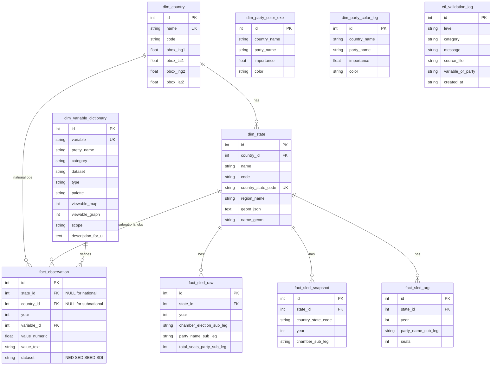
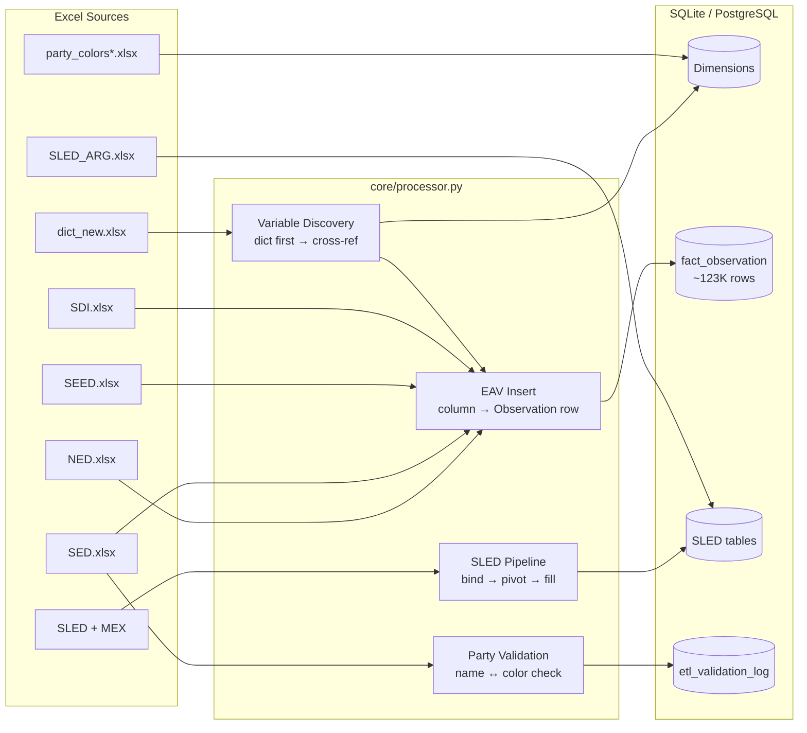

# SPP V2 – Relational Schema (EAV Architecture)

## Entity-Relationship Diagram

## Data Flow

## Table Summary

| Table | Type | Rows | Notes |
|---|---|---|---|
| `dim_variable_dictionary` | Dimension | 96 | 87 from dict + 9 auto-registered |
| `dim_country` | Dimension | 3 | With bboxes |
| `dim_state` | Dimension | 83 | With GeoJSON |
| `dim_party_color_exe` | Dimension | 85 | Exe styling |
| `dim_party_color_leg` | Dimension | 940 | Leg styling |
| `fact_observation` | Fact (EAV) | 122,739 | NED+SED+SEED+SDI |
| `fact_sled_raw` | Fact (wide) | 14,748 | Party-level grain |
| `fact_sled_snapshot` | Fact (wide) | 2,853 | Pivoted+filled |
| `fact_sled_arg` | Fact (wide) | 1,687 | Argentina tenure |
| `etl_validation_log` | Audit | 10 | Warnings logged |
